# 공유 Todo LIST 'Plan With ME'
- ### 서비스 URL : [pwm.ssc.co.kr](https://pwm.ssc.co.kr)

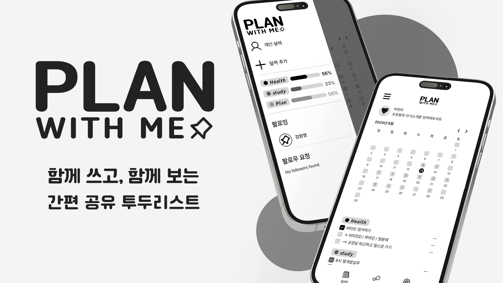

</br>

# 프로젝트 소개
```js
- 개인을 넘어선, 친구, 가족 등 원하는 사람과 함께 쓰는 달력형 To do list
- 팔로우 유저간 자신의 Todo list 공유
- 여러명과 함께 쓰는 Todo list

[구현 예정]
- 공통의 목표를 가진 사람과 할 일을 라운지에 공유 하여 가이드 라인과 동기 부여 제공
```

</br>

# Source Repository
### [PWM-FRONT (pwm-fe)](https://github.com/plan-with-me/pwm-fe)<br>


### [PWM-BACK (api server)](https://github.com/plan-with-me/api-server)<br>


</br>

# 팀원 구성
<table>
<tr>
    <td align="center" style="word-wrap: break-word; width: 150.0; height: 150.0">
        <a href=https://github.com/kwyoung96>
            
            <br />
            <sub style="font-size:14px"><b>Wonyoung Kang</b></sub><br>
            <sub style="font-size:12px"><b>Infra, UI/UX</b></sub>
        </a>
    </td>
    <td align="center" style="word-wrap: break-word; width: 150.0; height: 150.0">
        <a href=https://github.com/hyeonhe>
            
            <br />
            <sub style="font-size:14px"><b>Hyunhee Kim</b></sub><br>
            <sub style="font-size:12px"><b>Front-End</b></sub>
        </a>
    </td>
    <td align="center" style="word-wrap: break-word; width: 150.0; height: 150.0">
        <a href=https://github.com/cheon40>
            
            <br />
            <sub style="font-size:14px"><b>GyeongCheon Jo</b></sub><br>
            <sub style="font-size:12px"><b>Front-End</b></sub>
        </a>
    </td>
    <td align="center" style="word-wrap: break-word; width: 150.0; height: 150.0">
        <a href=https://github.com/B4NG8ANG>
            
            <br />
            <sub style="font-size:14px"><b>Inho Bang</b></sub><br>
            <sub style="font-size:12px"><b>Front-End</b></sub>
        </a>
    </td>
    <td align="center" style="word-wrap: break-word; width: 150.0; height: 150.0">
        <a href=https://github.com/5pponent>
            
            <br />
            <sub style="font-size:14px"><b>Taemin Lee</b></sub><br>
            <sub style="font-size:12px"><b>Back-End</b></sub>
        </a>
    </td>
</tr>
</table>
</br>

# Infra 구성
<div style="display: flex; gap: 10px;">
    
    
    
    
</div>
<br>
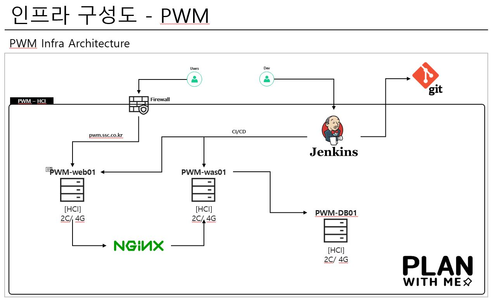

</br>

```js
Server : Rocky OS 8.6
CI/CD  : Jenkins 2.440.2
```
</br>

# ERD 구성 
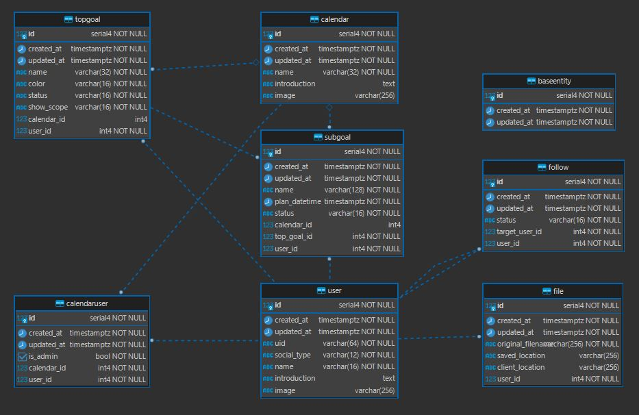


</br>

# 시연 동영상
- ### Youtube Link
[](https://www.youtube.com/watch?v=bzp8BReGXdU)

<br/>

# 기능 소개
## 로그인 화면
- 카카오, 구글 로그인 연동 구현
<div style="text-align: center;">
    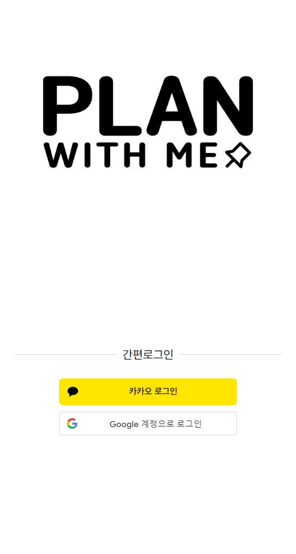
</div>
</br>

## 개인 To-do list
 - ### 홈 화면

<div style="display: flex; gap: 10px;">
    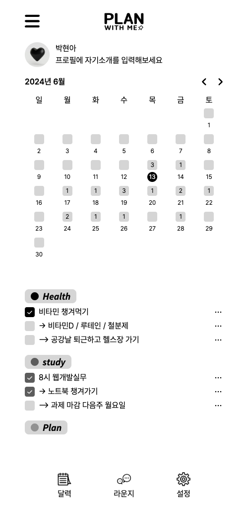
    
</div>
</br>

 - ### 상위 목표 생성
    - 고정할 상위 목표 설정
    - 상위 목표는 날짜와 상관없이 노출
    - 공개 범위 설정 (나만 보기, 팔로워 공개, 전체공개)
    - 색상 지정 가능

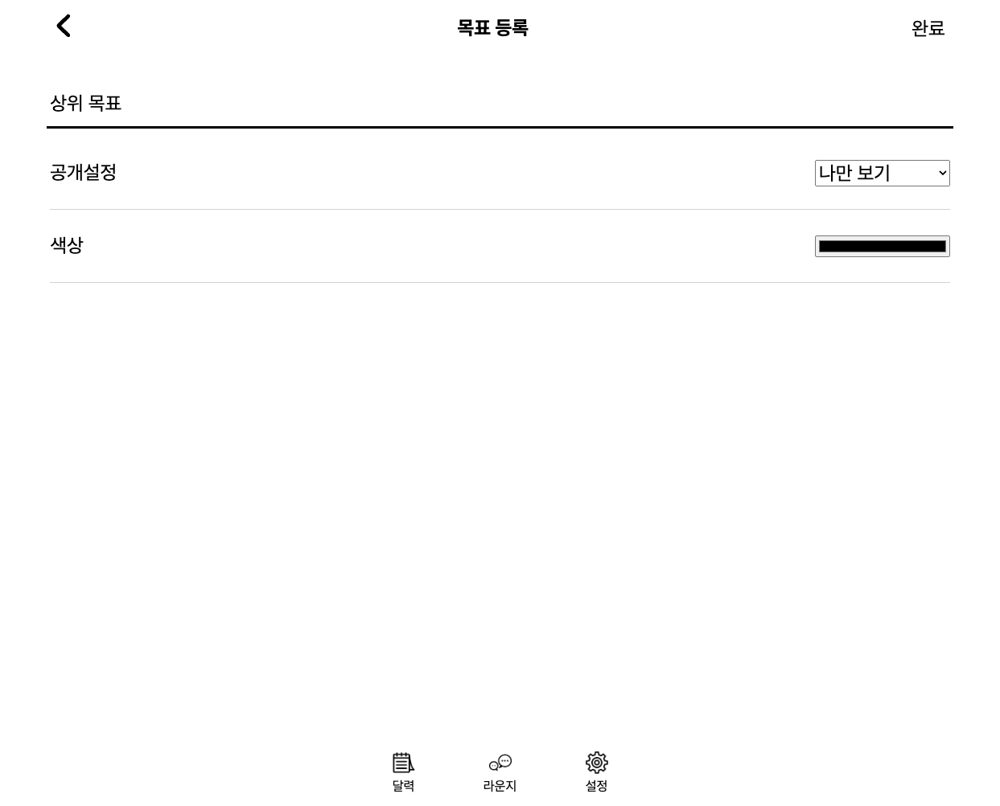

</br>

 - ### 하위 목표 생성
    - 생성한 상위목표를 클릭하면 하위 목표 생성 가능
    - 하위 목표는 생성한 날짜에만 노출

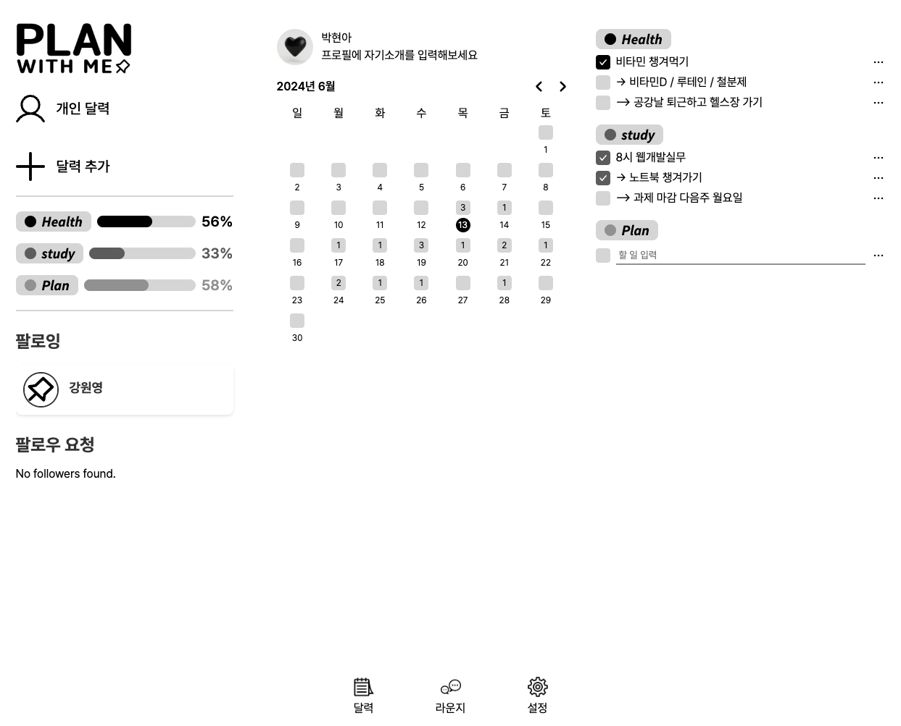

</br>

## 지인의 To-do list
 - ### 팔로잉 유저의 홈 화면 탐색

<div style="display: flex; gap: 10px;">
        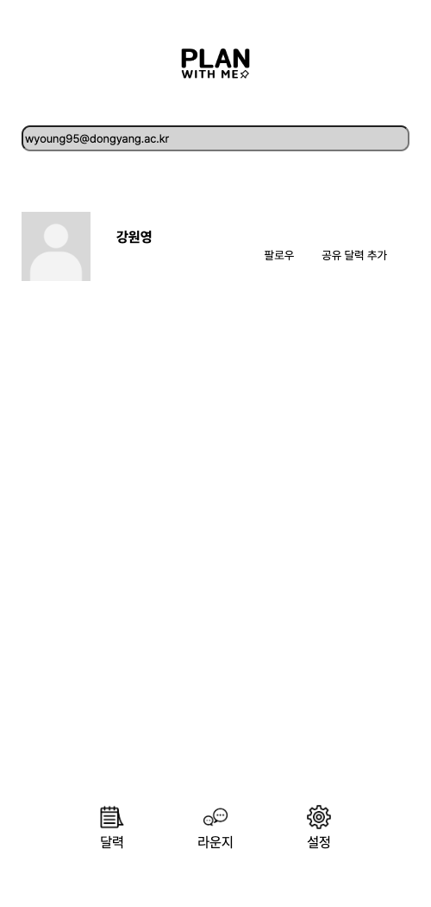
        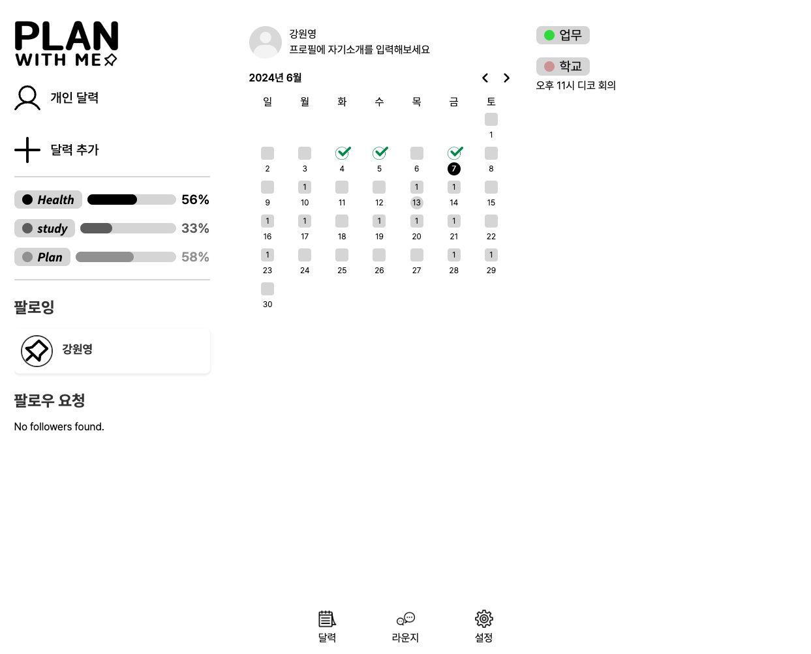
</div>

</br>

## 그룹의 To-do list
 - ### 그룹 To-do list 생성 및 초대
    <div style="display: flex; gap: 10px;">
        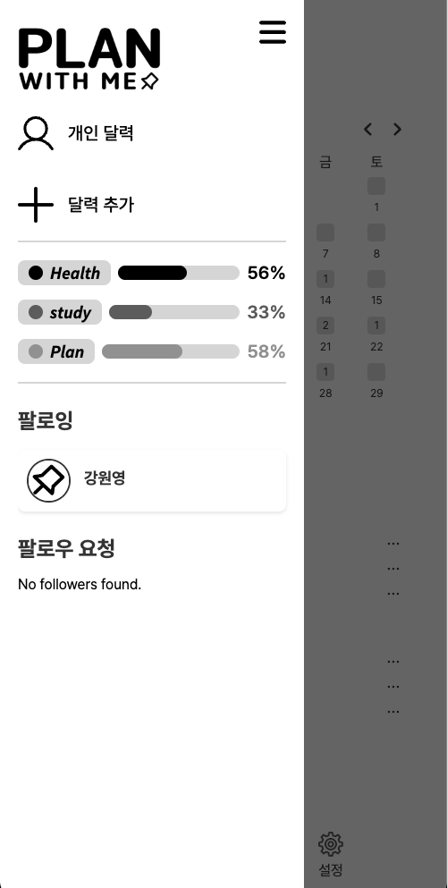
        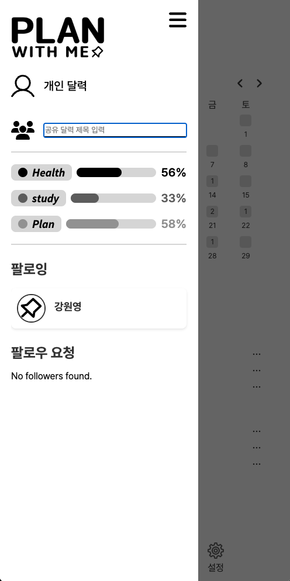
        
    </div>

 - ### 그룹 인원 관리 및 그룹 홈 화면

<div style="display: flex; gap: 10px;">
        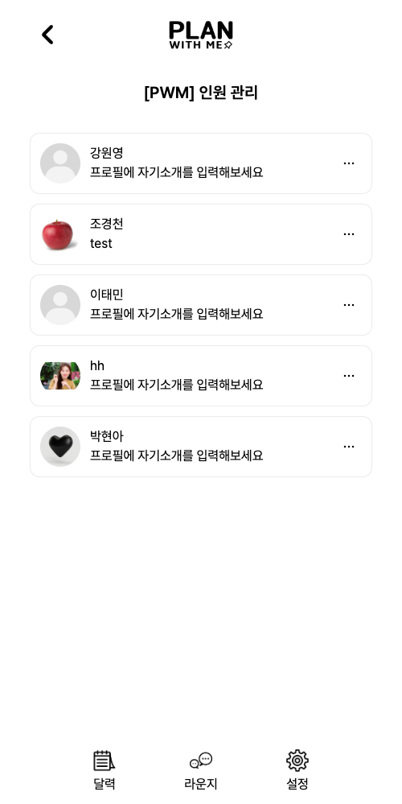
        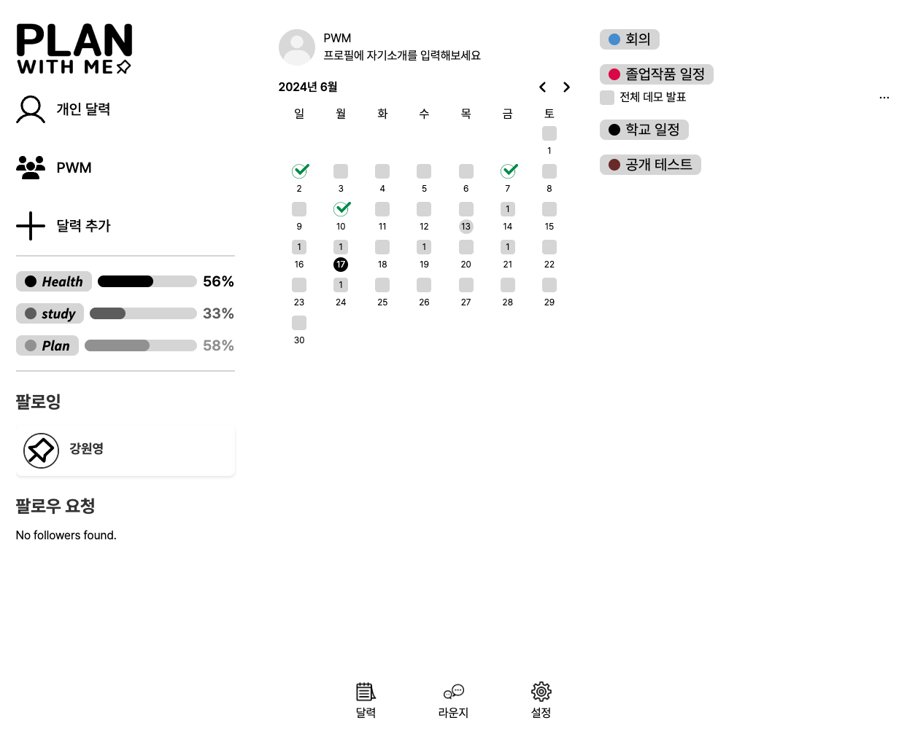
</div>

</br>

## 모두의 To-do list
- 24년 하반기 오픈 예정

</br>

[](https://hits.seeyoufarm.com)
