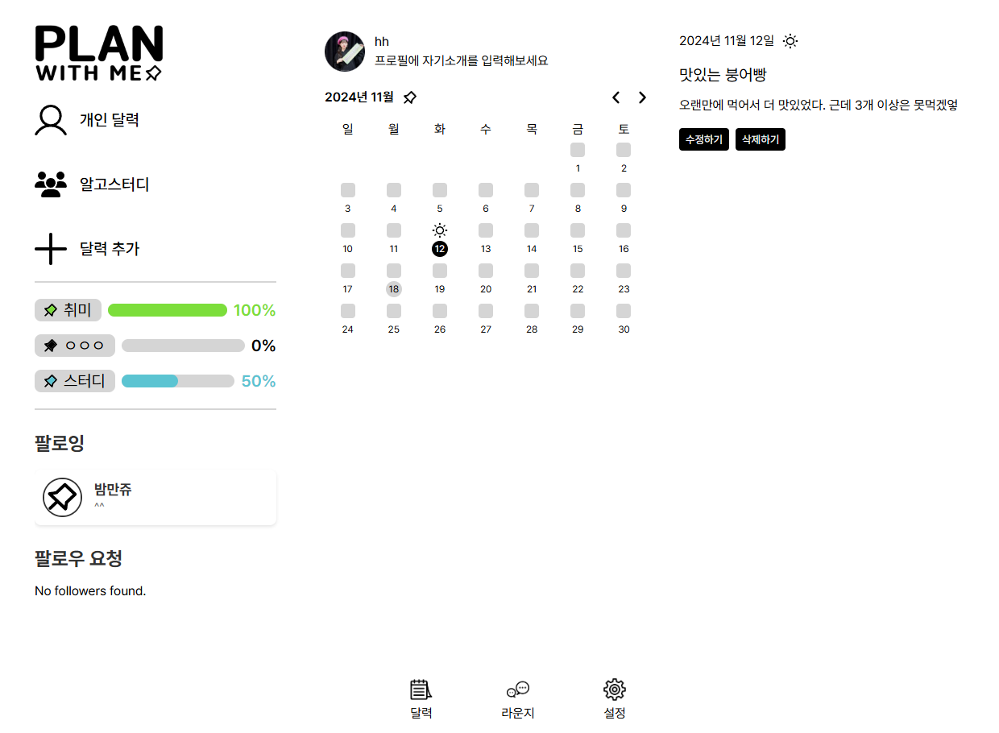

# 공유 Todo LIST 'Plan With ME'

- ### 서비스 URL : [pwm.ssc.co.kr](https://pwm.ssc.co.kr)


</br>

# 프로젝트 소개

```
- 개인을 넘어선, 친구, 가족 등 원하는 사람과 함께 쓰는 달력형 To do list
- 팔로우 유저간 자신의 Todo list 공유
- 여러명과 함께 쓰는 Todo list
```


</br>

# 팀원 구성

<table>
<tr>
    <td align="center" style="word-wrap: break-word; width: 150.0; height: 150.0">
        <a href=https://github.com/kwyoung96>
            
            <br />
            <sub style="font-size:14px"><b>Wonyoung Kang</b></sub><br>
            <sub style="font-size:12px"><b>Infra, UI/UX</b></sub>
        </a>
    </td>
    <td align="center" style="word-wrap: break-word; width: 150.0; height: 150.0">
        <a href=https://github.com/hyeonhe>
            
            <br />
            <sub style="font-size:14px"><b>Hyunhee Kim</b></sub><br>
            <sub style="font-size:12px"><b>Front-End</b></sub>
        </a>
    </td>
    <td align="center" style="word-wrap: break-word; width: 150.0; height: 150.0">
        <a href=https://github.com/cheon40>
            
            <br />
            <sub style="font-size:14px"><b>GyeongCheon Jo</b></sub><br>
            <sub style="font-size:12px"><b>Front-End</b></sub>
        </a>
    </td>
    <td align="center" style="word-wrap: break-word; width: 150.0; height: 150.0">
        <a href=https://github.com/B4NG8ANG>
            
            <br />
            <sub style="font-size:14px"><b>Inho Bang</b></sub><br>
            <sub style="font-size:12px"><b>Front-End</b></sub>
        </a>
    </td>
    <td align="center" style="word-wrap: break-word; width: 150.0; height: 150.0">
        <a href=https://github.com/5pponent>
            
            <br />
            <sub style="font-size:14px"><b>Taemin Lee</b></sub><br>
            <sub style="font-size:12px"><b>Back-End</b></sub>
        </a>
    </td>
</tr>
</table>
</br>

# Source Repository

### [PWM-FRONT (pwm-fe)](https://github.com/plan-with-me/pwm-fe)<br>


### [PWM-BACK (api server)](https://github.com/plan-with-me/api-server)<br>


</br>

# 프로젝트 PPT

[최종 발표 ppt](https://github.com/plan-with-me/.github/blob/main/photo/%EC%B5%9C%EC%A2%85_Plan%20With%20Me.pptx)

# 서비스 구성도


# Infra 구성

<div style="display: flex; gap: 10px;">
    
    
    
    
</div>
<br>


</br>

```js
Server : Rocky OS 8.6
CI/CD  : Jenkins 2.440.2
```

</br>

# ERD 구성


</br>

# 시연 동영상

- ### Youtube Link
  [](https://www.youtube.com/watch?v=reBLQGE7SNM)

<br/>

# 기능 소개

## 로그인 화면

- 카카오, 구글 로그인 연동 구현
<div style="text-align: center;">
    
</div>
</br>

## 개인 Todo list

- ### 홈 화면

<div style="display: flex; gap: 10px;">
    
    
</div>
</br>

- ### 상위 목표 생성
  - 고정할 상위 목표 설정
  - 상위 목표는 날짜와 상관없이 노출
  - 공개 범위 설정 (나만 보기, 팔로워 공개, 전체공개)
  - 색상 지정 가능


</br>

- ### 하위 목표 생성
  - 생성한 상위목표를 클릭하면 하위 목표 생성 가능
  - 하위 목표는 생성한 날짜에만 노출


</br>

- ### 일기 작성
  - 일기 아이콘을 눌러 일기 페이지로 이동
  - 해당 날짜의 일기를 작성할 수 있으며, 날씨와 공개 여부를 설정할 수 있음
    

## 지인의 Todo list

- ### 팔로잉 유저의 홈 화면 탐색

<div style="display: flex; gap: 10px;">
        
        
</div>

</br>

## 그룹 Todo list

- ### 그룹 Todo list 생성 및 초대

   <div style="display: flex; gap: 10px;">
       
       
       
   </div>

- ### 그룹 인원 관리 및 그룹 홈 화면

<div style="display: flex; gap: 10px;">
        
        
</div>

</br>

## 라운지


